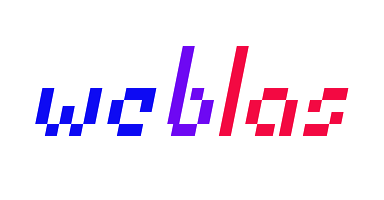

Unpacked RGBA plugin for [weblas](https://github.com/waylonflinn/weblas). Check it out if you haven't.

This plugin attempts to optimize in favour of more computations and fewer reads. Algorithms spending more cycles in GPU than CPU.

Using the original packed format there is some overhead due to packing and unpacking the data at each CPU > GPU and GPU > CPU transfer.

#### Unpacked format optimizations:

* directly uploads data avoiding padding via the webgl LUMINANCE format
* simplifies glsl logic and computations of intermediate results given the nearly 1 to 1 data mapping
* prevents glsl added computations when float32-encoding result values ( original packed format inherits this facility )

#### Some compromises:

* GPU memory requirement is increased four times
	can be recovered via the combination of multiple data textures of same shape into one
	or combining up to four intermediate result variables side by side on each RGBA channel
	
* computations don't benefit from glsl vectorized operations
	can be recovered via saves in padding/packing/float conversion computations
	(ie. transposing is achieved by directly switiching texture coordinates dimensions)

* currently only sgemm is implemented

# Usage

weblas-unpacked depends on weblas, include both `weblas.js` and `weblas-unpacked.js` (from `dist` directory).

```html
<script type="text/javascript" src="weblas.js"></script>
<script type="text/javascript" src="weblas-unpacked.js"></script>
```

### Following weblas pipeline example:

```javascript
// create unpacked Tensor containers for interacting directly with GPU memory
var cpu_data0 = [0,1,2,
				 3,4,5]
				 
var M0 = 3, N0 = 2
var t0 = new weblas.unpacked.Tensor( [M0, N0], cpu_data0 )

// unpacked Tensor does not require transposing
// it does assume you are providing matrices which can be multiplied together
var cpu_data1 = [7,6,
				 5,4,
				 3,2,
				 1,0]
				 
var M1 = 2, N1 = 4
var t1 = new weblas.unpacked.Tensor( [M1, N1], cpu_data1 ) // (ie. N0 == M1)

// optional matrix to add to result is mapped directly
var cpu_data2 = [0.0,0.1,0.2,
				 0.3,0.4,0.5,
				 0.6,0.7,0.8,
				 0.9,1.0,1.1]
				 
var t2 = new weblas.unpacked.Tensor( [M0, N1], cpu_data2 )

//var alpha = 1.0; (soon)
//var beta = 0.5;

// execute the computation
var t3 = weblas.unpacked.blas.sgemm( t0, t1, t2 )

// result is a Float32Array
var result = t3.download( true ) // flag true to keep data in GPU for other computations
var resultRGBA = t3.download( true, true ) // download full RGBA texture
console.log( result, resultRGBA )
```


### Additional features:

```javascript
// make a GPU copy
var t4 = t3.duplicate()

// convert it to original packed format
t4.pack()

// convert back to unpacked format and save it in the
// [ 0 = R || 1 = G || 2 = B || 3 = A ] channel ( RED if ommited )
t4.unpack( 2 )

// transpose and keep the original
var t4T = t4.transpose( true )

// currently t4T is unpacked but transfer() is also available
var resultT_unpacked = t4T.transfer() // console warning

// pack it
t4T.pack()
var resultT_packed = t4T.transfer() // no warning

// ( resultT_unpacked[i] == resultT_packed[i] ) = true

/*
	t4T is now in packed format
	do some other weblas computations
	unavailable for unpacked format
	...
*/

```
